# Sistema de Monitoreo y Control Distribuido (SRMP)

**Curso:** Internet: Arquitectura y Protocolos / Telemática  
**Periodo:** 2026-2  
**Plataforma de ejecución y pruebas:** Linux (Kali Linux en VirtualBox)  
**Arquitectura:** servidor central + dos o más nodos + uno o más clientes

---

## 1. Introducción

El proyecto implementa un sistema distribuido de monitoreo en el que varios nodos reportan periódicamente métricas al servidor central y pueden generar eventos cuando una métrica supera un umbral. Los clientes de administración se conectan al servidor para consultar el estado actual y el histórico de los nodos.

La arquitectura sigue el modelo cliente-servidor definido para la práctica: los nodos se comunican directamente con el servidor y los clientes consultan la información almacenada por el servidor. No existe comunicación directa entre nodos y clientes.

El servidor está implementado en C mediante la API de Berkeley Sockets. Los nodos y el cliente están implementados en Python.

La solución utiliza TCP y UDP de forma combinada:

- **TCP:** registro de nodos, autenticación, eventos y consultas/respuestas del cliente.
- **UDP:** envío periódico de telemetría (`ESTADO`).

---

## 2. Objetivos

### 2.1 Objetivo general

Diseñar e implementar un sistema distribuido de monitoreo capaz de recibir información periódica de múltiples nodos, registrar eventos, mantener el estado actual e histórico de los nodos y permitir consultas mediante clientes autenticados.

### 2.2 Objetivos específicos

- Implementar un servidor central en C utilizando Berkeley Sockets.
- Permitir el registro de múltiples nodos.
- Recibir telemetría periódica mediante UDP.
- Recibir eventos críticos mediante TCP.
- Mantener el estado actual de cada nodo.
- Mantener hasta cinco mediciones históricas por nodo.
- Permitir consultas desde clientes autenticados.
- Atender múltiples clientes TCP mediante hilos.
- Detectar nodos que dejan de reportar información mediante un temporizador.
- Registrar peticiones y respuestas en consola y archivo de logs.
- Resolver nombres de host antes de establecer las conexiones.
- Manejar errores de conexión, autenticación, mensajes desconocidos y parámetros inexistentes.

---

## 3. Arquitectura del sistema

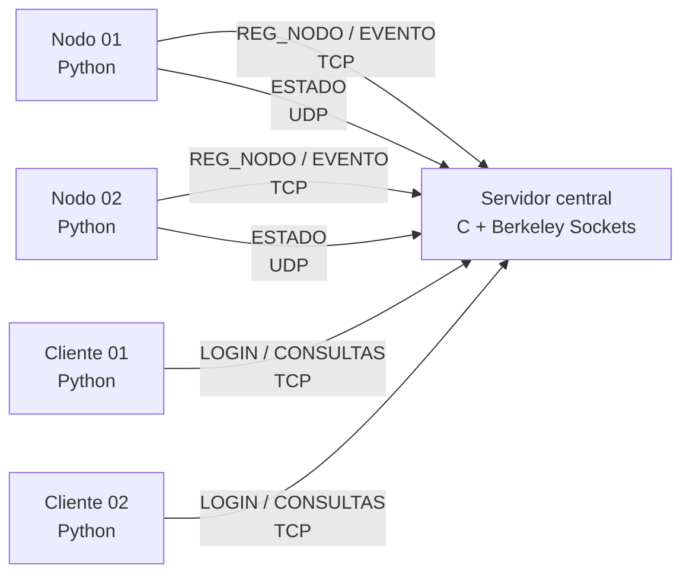

### 3.1 Componentes

| Componente | Lenguaje | Función |
|---|---|---|
| `server/server.c` | C | Servidor central, sockets TCP/UDP, concurrencia, estado, histórico, logs y procesamiento del protocolo. |
| `server/protocol.h` | C | Define los tipos de mensaje y la estructura común del protocolo SRMP. |
| `server/auth.c` / `auth.h` | C | Módulo de autenticación y lectura de perfiles. |
| `server/users.txt` | Texto | Contiene las credenciales de prueba y perfiles. |
| `server/Makefile` | Make | Automatiza la compilación del servidor. |
| `nodes/node.py` | Python | Registra el nodo, obtiene RAM, genera temperatura simulada, envía telemetría y reporta eventos. |
| `clients/client.py` | Python | Autentica usuarios y permite consultar estado actual e histórico. |

---

## 4. Entorno de ejecución

El proyecto fue ejecutado y probado en **Kali Linux dentro de VirtualBox**.

El servidor se compila con `gcc` y el proyecto utiliza `make`. Los nodos y clientes se ejecutan con Python 3.

La ejecución en Linux facilita el uso de la API de Berkeley Sockets y de `pthread` para la concurrencia del servidor.

> **Nota sobre las métricas:** el porcentaje de RAM se obtiene mediante `psutil` cuando está instalado. La temperatura se genera de forma simulada en el nodo porque la máquina virtual de VirtualBox no expone los sensores térmicos del equipo físico a Kali.

---

## 5. Protocolo de aplicación SRMP

El proyecto utiliza un protocolo de aplicación propio denominado **SRMP (Sistema de Registro y Monitoreo Protocol)**.

Cada mensaje tiene la siguiente estructura:

```text
TIPO|ID_ORIGEN|ID_MENSAJE|TIMESTAMP|LONGITUD_PAYLOAD|PAYLOAD
```

### 5.1 Campos

| Campo | Descripción |
|---|---|
| `TIPO` | Identifica la operación o respuesta. |
| `ID_ORIGEN` | Identificador del nodo, cliente o servidor que origina el mensaje. |
| `ID_MENSAJE` | Identificador secuencial del mensaje. |
| `TIMESTAMP` | Fecha y hora del mensaje en formato UTC. |
| `LONGITUD_PAYLOAD` | Cantidad de caracteres del payload generado por el emisor. |
| `PAYLOAD` | Información específica de la operación. |

Ejemplo:

```text
ESTADO|nodo01|12|2026-09-30T00:42:39Z|18|RAM=13.5;TEMP=73.9
```

---

## 6. Vocabulario de mensajes

| Mensaje | Transporte | Emisor | Propósito |
|---|---|---|---|
| `REG_NODO` | TCP | Nodo | Registrar un nodo ante el servidor. |
| `ESTADO` | UDP | Nodo | Enviar periódicamente RAM y temperatura. |
| `EVENTO` | TCP | Nodo | Informar una condición crítica, por ejemplo `TEMP_ALTA`. |
| `LOGIN` | TCP | Cliente | Autenticar al usuario. |
| `CONSULTA_ACTUAL` | TCP | Cliente | Consultar el estado actual de uno o todos los nodos. |
| `CONSULTA_HIST` | TCP | Cliente | Consultar el histórico de un nodo. |
| `ACK` | TCP | Servidor | Confirmar operaciones que requieren respuesta. |
| `RESP_ESTADO` | TCP | Servidor | Responder una consulta de estado. |
| `RESP_HIST` | TCP | Servidor | Responder una consulta histórica. |
| `ERROR` | TCP | Servidor | Informar errores de operación o autenticación. |

---

## 7. Flujo de registro de un nodo

1. El nodo recibe por consola el host, puerto e identificador.
2. El nodo resuelve el host mediante `socket.getaddrinfo()`.
3. El nodo establece una conexión TCP con el servidor.
4. Envía `REG_NODO`.
5. El servidor registra el identificador del nodo.
6. El servidor responde `ACK|...|OK`.
7. El nodo comienza su ciclo periódico de telemetría.

Ejemplo:

```text
REG_NODO|nodo01|1|2026-09-30T00:41:52Z|0|
```

Respuesta:

```text
ACK|servidor|1|2026-09-30T00:41:52Z|2|OK
```

---

## 8. Envío periódico de telemetría

Cada nodo ejecuta un ciclo cada **5 segundos**.

En cada iteración:

1. Obtiene el porcentaje de RAM.
2. Genera la temperatura simulada.
3. Construye un mensaje `ESTADO`.
4. Lo envía mediante UDP.
5. Comprueba los umbrales.
6. Si un umbral se supera, envía un `EVENTO` mediante TCP.

Payload de ejemplo:

```text
RAM=14.9;TEMP=72.8
```

El servidor actualiza:

- RAM actual.
- Temperatura actual.
- Fecha/hora de la última actualización.
- Estado del nodo.
- Histórico de las últimas cinco mediciones.

---

## 9. Eventos críticos

Los umbrales definidos en el nodo son:

```text
UMBRAL_RAM  = 90.0 %
UMBRAL_TEMP = 70.0 °C
```

Cuando se supera un umbral se envía un mensaje `EVENTO` por TCP.

Ejemplo:

```text
EVENTO|nodo01|12|2026-09-30T00:42:39Z|23|TIPO=TEMP_ALTA;VAL=73.9
```

El servidor registra el evento y responde:

```text
ACK|servidor|3|2026-09-30T00:42:39Z|2|OK
```

Se utiliza TCP porque los eventos se consideran información importante y el diseño busca una entrega confiable y ordenada para este tipo de comunicación.

---

## 10. Consultas del cliente

Después de autenticarse, el cliente presenta tres operaciones principales:

1. Consultar el estado actual de todos los nodos.
2. Consultar el estado actual de un nodo específico.
3. Consultar el histórico de un nodo.

### 10.1 Estado actual

El cliente envía:

```text
CONSULTA_ACTUAL|cliente01|2|2026-09-30T00:55:35Z|8|nodo=ALL
```

El servidor responde con `RESP_ESTADO` y una entrada por nodo.

Ejemplo de payload:

```text
nodo01,RAM=15.2,TEMP=69.8,ESTADO=ACTIVO;nodo02,RAM=15.2,TEMP=57.8,ESTADO=ACTIVO;
```

### 10.2 Histórico

El servidor almacena hasta cinco mediciones por nodo mediante un arreglo circular.

El cliente puede solicitar el histórico mediante `CONSULTA_HIST` y recibe `RESP_HIST`.

Ejemplo mostrado durante las pruebas:

```text
Hora        RAM %     TEMP C
--------------------------------
01:51:35    15.9      54.0
01:51:40    15.9      42.8
01:51:45    15.9      66.3
01:51:50    15.9      66.0
01:51:55    15.9      69.6
```

---

## 11. Selección de TCP y UDP

La arquitectura utiliza ambos protocolos de transporte porque los mensajes tienen características diferentes.

### UDP para `ESTADO`

Los estados se envían periódicamente cada cinco segundos. Una medición individual puede perderse porque el nodo enviará otra medición posteriormente. Por esta razón, el diseño prioriza el envío periódico y de baja sobrecarga.

Además, el servidor mantiene un temporizador de actividad: si un nodo deja de enviar estados durante más de 15 segundos, se marca como `INACTIVO`.

### TCP para mensajes críticos y consultas

Se utiliza TCP para:

- registro de nodos;
- autenticación;
- eventos críticos;
- consultas del cliente;
- respuestas del servidor.

Estas operaciones necesitan una comunicación confiable y ordenada. En particular, los eventos críticos no se tratan igual que la telemetría periódica.

---

## 12. Concurrencia del servidor

El servidor utiliza `pthread`.

### Hilo principal

El hilo principal mantiene el socket TCP en estado de escucha y acepta nuevas conexiones.

Por cada cliente TCP aceptado se crea un hilo independiente mediante `pthread_create()`.

### Hilo UDP

Existe un hilo dedicado a recibir mensajes `ESTADO` mediante `recvfrom()`.

### Hilo de timeout

Existe un hilo dedicado a revisar periódicamente el tiempo transcurrido desde la última actualización de cada nodo.

### Protección del estado compartido

Los datos globales de los nodos están protegidos mediante `pthread_mutex_t`, evitando accesos simultáneos inconsistentes.

También se utilizan mutex independientes para el archivo de logs y el contador global de mensajes.

---

## 13. Detección de nodos inactivos

El servidor utiliza:

```text
NODE_TIMEOUT_SECONDS = 15
```

El hilo de timeout revisa los nodos cada cinco segundos. Si el tiempo desde el último `ESTADO` supera los 15 segundos, el nodo pasa a:

```text
INACTIVO
```

Cuando vuelve a recibirse una medición de un nodo que estaba inactivo, el servidor vuelve a marcarlo como:

```text
ACTIVO
```

Durante las pruebas se detuvo `nodo01`, se esperó el timeout y posteriormente se volvió a ejecutar. El cliente mostró primero `INACTIVO` y después `ACTIVO`.

---

## 14. Autenticación

El cliente solicita usuario y contraseña mediante `LOGIN`.

El servidor delega la validación en `auth.c`, que consulta `users.txt`.

Usuarios de prueba:

| Usuario | Contraseña | Perfil |
|---|---|---|
| `admin` | `admin123` | `ADMIN` |
| `consulta` | `consulta123` | `CONSULTA` |

La autenticación se mantiene por conexión TCP: antes de ejecutar `CONSULTA_ACTUAL` o `CONSULTA_HIST`, el servidor comprueba que la conexión haya sido autenticada.

### Perfiles y permisos

El perfil `ADMIN` puede consultar el estado actual y el histórico. El perfil `CONSULTA` puede consultar el estado actual, pero el servidor rechaza `CONSULTA_HIST` con `ERROR|...|PERMISO_DENEGADO`. La comprobación se hace en el servidor, por lo que no depende de la interfaz del cliente.

### Nota sobre almacenamiento de usuarios

La implementación utiliza un archivo local de texto para las credenciales. El código separa esta responsabilidad en el módulo `auth.c`, de manera que la función `auth_check()` encapsula el acceso a las credenciales. Para una versión posterior podría sustituirse este módulo por un servicio de autenticación externo.

---

## 15. Resolución de nombres

Los nodos y clientes reciben un host mediante línea de comandos, por ejemplo:

```bash
--host localhost
```

Antes de establecer la conexión, Python utiliza `socket.getaddrinfo()` para resolver el host.

El servidor también implementa `getnameinfo()` para intentar resolver el nombre del cliente al registrar la información de conexión. Si la resolución falla, conserva la IP y continúa funcionando.

Esto evita depender de una dirección IP fija escrita directamente en el código de nodos o clientes.

---

## 16. Logging

El servidor registra las peticiones y respuestas tanto en consola como en el archivo indicado al iniciar el programa.

Ejemplo de ejecución:

```bash
./server 9000 servidor.log
```

El formato de los logs incluye:

- fecha/hora;
- dirección IP;
- puerto;
- dirección del mensaje (`IN`, `OUT` o `IN(UDP)`);
- contenido del mensaje.

Ejemplo:

```text
[2026-09-30T00:42:39Z] IN(UDP) 127.0.0.1:52418 -> ESTADO|nodo01|...
[2026-09-30T00:42:39Z] IN 127.0.0.1:42900 -> EVENTO|nodo01|...
[2026-09-30T00:42:39Z] OUT 127.0.0.1:42900 -> ACK|servidor|...
```

---

## 17. Manejo de errores

La implementación contempla diferentes situaciones de error.

### Resolución de host

Si `getaddrinfo()` falla, el cliente o nodo informa el error y no utiliza una IP inventada.

### Conexión rechazada o fallida

Los nodos y clientes capturan errores de conexión y muestran un mensaje al usuario.

### Autenticación incorrecta

El servidor devuelve:

```text
ERROR ... CREDENCIALES_INVALIDAS
```

### Consulta sin autenticación

El servidor devuelve:

```text
ERROR ... NO_AUTENTICADO
```

### Tipo de mensaje desconocido

El servidor devuelve:

```text
ERROR ... TIPO_MENSAJE_DESCONOCIDO
```

### Mensaje TCP con formato inválido

Si el servidor no puede separar correctamente los seis campos esperados, responde:

```text
ERROR ... FORMATO_INVALIDO
```

### Nodo no registrado

Para eventos o históricos de nodos que no están registrados se puede devolver:

```text
NODO_NO_REGISTRADO
```

### Desconexión de cliente

El hilo correspondiente detecta la desconexión, cierra el socket y libera los recursos sin detener el servidor completo.

### `SIGPIPE`

El servidor ignora `SIGPIPE` para evitar terminar el proceso cuando un cliente cierre la conexión de forma abrupta antes de una respuesta.

---

## 18. Ejecución del proyecto

### 18.1 Servidor

```bash
cd ~/Desktop/proyecto/server
make
./server 9000 servidor.log
```

Salida esperada:

```text
Servidor SRMP escuchando en el puerto 9000 (TCP y UDP)
```

### 18.2 Nodo 1

En otra terminal:

```bash
cd ~/Desktop/proyecto/nodes
python3 node.py --host localhost --port 9000 --id nodo01
```

### 18.3 Nodo 2

En otra terminal:

```bash
cd ~/Desktop/proyecto/nodes
python3 node.py --host localhost --port 9000 --id nodo02
```

### 18.4 Cliente

En otra terminal:

```bash
cd ~/Desktop/proyecto/clients
python3 client.py --host localhost --port 9000
```

### 18.5 Dependencia de Python

Para obtener la RAM real mediante `psutil`:

```bash
pip install psutil --break-system-packages
```

Si `psutil` no está disponible, el nodo tiene un modo de respaldo que simula también la RAM.

---

# 19. Pruebas realizadas

Las pruebas se realizaron en Kali Linux y cubrieron comunicación, concurrencia, consultas y resiliencia.

## 19.1 Compilación e inicio del servidor

Se ejecutó `make` y posteriormente el servidor en el puerto 9000 utilizando `servidor.log`.

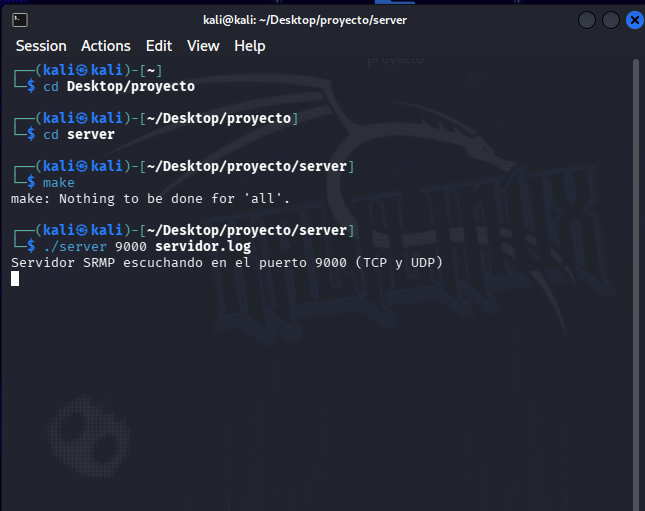

**Resultado:** el servidor inicia correctamente y queda escuchando simultáneamente por TCP y UDP.

---

## 19.2 Registro y telemetría del nodo 1

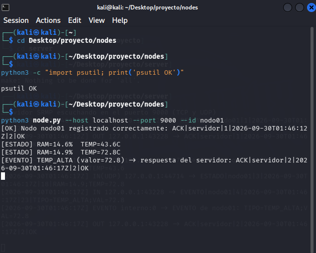

**Resultado:** `nodo01` se registra correctamente, envía mensajes `ESTADO` y genera un evento `TEMP_ALTA` cuando la temperatura simulada supera los 70 °C. El servidor responde con `ACK` al evento.

---

## 19.3 Registro y telemetría del nodo 2

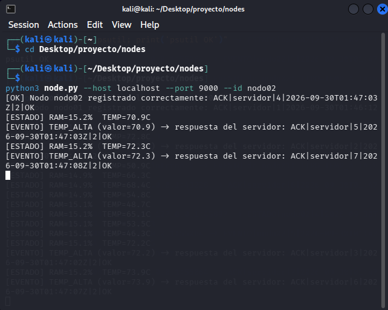

**Resultado:** un segundo nodo puede registrarse y transmitir telemetría simultáneamente, demostrando la arquitectura distribuida con más de un nodo.

---

## 19.4 Consulta del cliente

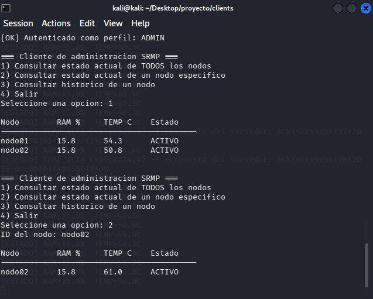

**Resultado:** el cliente se autentica como `ADMIN` y puede consultar el estado de todos los nodos y el estado de un nodo específico.

---

## 19.5 Histórico de cinco mediciones

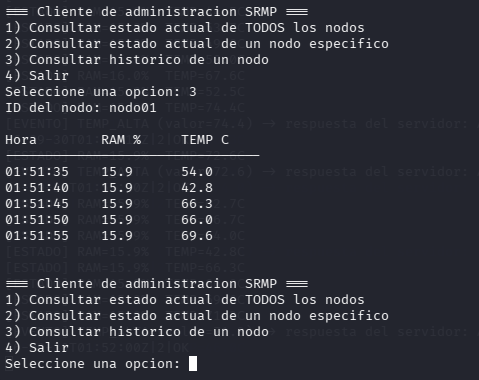

**Resultado:** el servidor mantiene y entrega cinco mediciones históricas de un nodo, incluyendo hora, RAM y temperatura.

---

## 19.6 Concurrencia de clientes

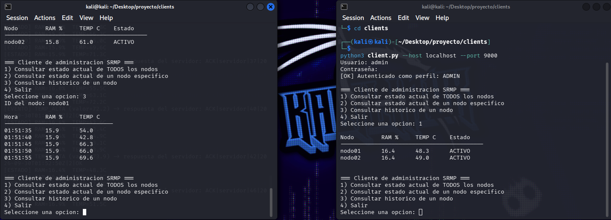

**Resultado:** se ejecutan dos clientes simultáneamente y ambos pueden realizar consultas contra el mismo servidor. Esto demuestra el uso de hilos para atender conexiones TCP concurrentes.

---

## 19.7 Timeout y recuperación de un nodo

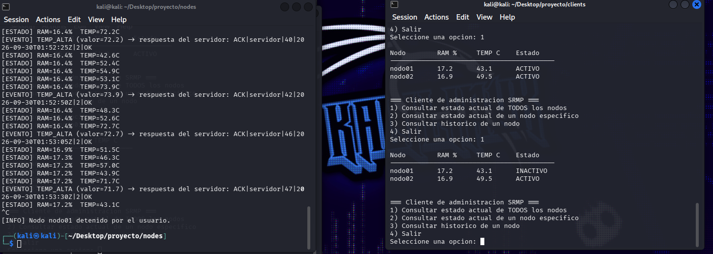

**Resultado:** al detener un nodo, después del periodo de timeout el servidor lo marca como `INACTIVO`. Al volver a ejecutar el nodo, este se registra nuevamente y vuelve a aparecer como `ACTIVO`.

---

## 19.8 Manejo de entrada inválida del cliente

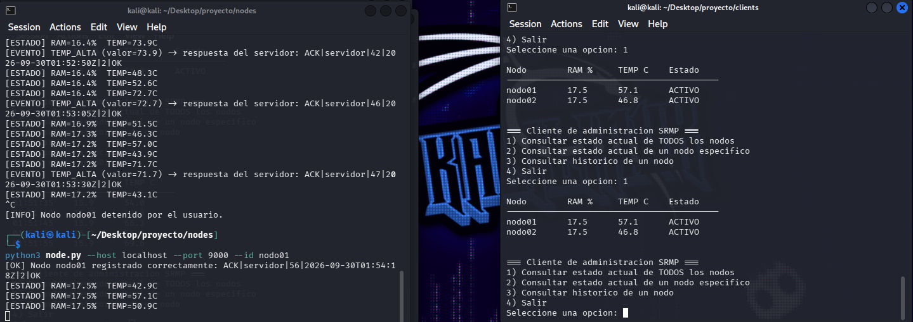

**Resultado:** cuando el usuario introduce una opción que no pertenece al menú, el cliente informa `Opcion invalida.` y continúa funcionando.

---

## 19.9 Registro de actividad en servidor.log

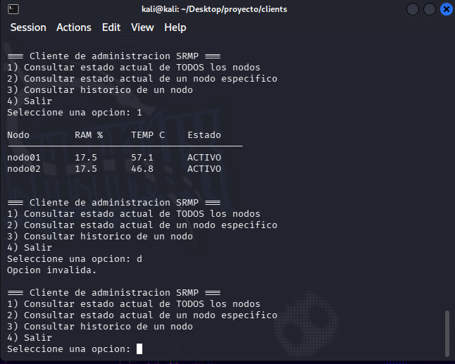

**Resultado:** el archivo de logs contiene registros de estados UDP, eventos TCP, respuestas `ACK`, identificadores de nodos y direcciones IP/puertos de origen.

---

## 19.10 Prueba adicional de funcionamiento

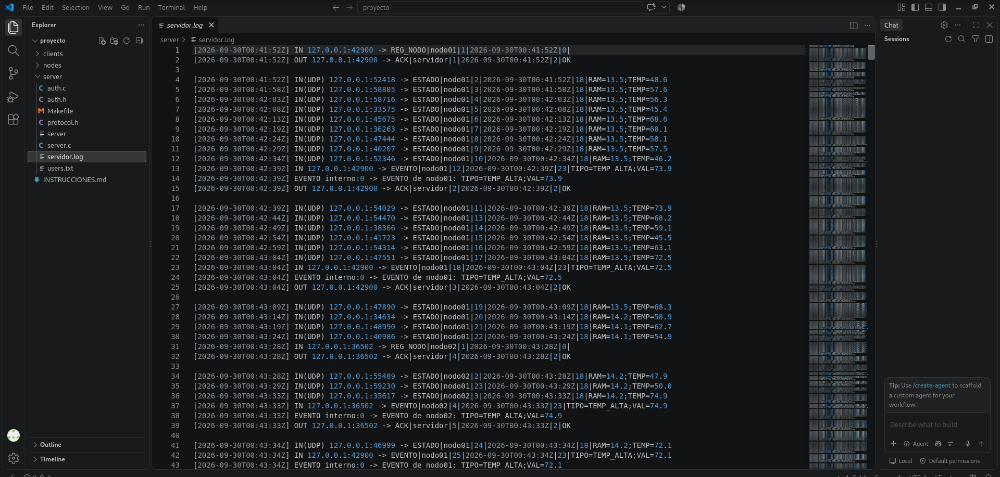

Esta evidencia complementa las pruebas anteriores y muestra la ejecución continua de nodos y consultas del cliente durante el monitoreo.

---

# 20. Estructura del proyecto

```text
proyecto/
├── server/
│   ├── server.c
│   ├── protocol.h
│   ├── auth.c
│   ├── auth.h
│   ├── users.txt
│   └── Makefile
├── nodes/
│   └── node.py
├── clients/
│   └── client.py
├── docs/
│   ├── DOCUMENTACION.md
│   └── evidencias/
└── INSTRUCCIONES.md
```

### Responsabilidad de los archivos principales

**`server.c`**: implementación del servidor, sockets TCP/UDP, hilos, almacenamiento de nodos, histórico, timeout, consultas, eventos y logging.

**`protocol.h`**: constantes de los tipos de mensaje y estructura `SrmpMsg`.

**`auth.c` / `auth.h`**: autenticación de usuarios y obtención del perfil.

**`users.txt`**: usuarios de prueba.

**`Makefile`**: compilación del servidor con GCC y `pthread`.

**`node.py`**: implementación del nodo productor de telemetría.

**`client.py`**: implementación del cliente de administración.

---

# 21. Conclusiones

El sistema implementa una arquitectura distribuida de monitoreo con un servidor central, múltiples nodos y clientes de administración. La comunicación se realiza mediante un protocolo de aplicación propio integrado sobre TCP y UDP.

La combinación de TCP y UDP permite diferenciar entre telemetría periódica y operaciones que requieren mayor confiabilidad. El servidor mantiene el estado actual y un histórico de las mediciones, atiende múltiples conexiones mediante hilos y utiliza mecanismos de sincronización para proteger el estado compartido.

Las pruebas realizadas demostraron el registro de múltiples nodos, envío periódico de telemetría, generación de eventos, consultas actuales e históricas, concurrencia de clientes, detección de timeout, recuperación de nodos y generación de logs.

Como limitaciones conocidas de esta versión, la temperatura de los nodos es simulada debido al entorno virtualizado utilizado para las pruebas. Además, las credenciales se almacenan en el archivo local `users.txt`; el módulo de autenticación está separado de la lógica principal para facilitar una futura sustitución por un servicio externo.

---

# 22. Preparación para la sustentación

Las preguntas técnicas principales que deben poder responderse a partir de este proyecto son:

1. ¿Qué es un socket y qué función cumple en el proyecto?
2. ¿Por qué el servidor utiliza Berkeley Sockets?
3. ¿Por qué `ESTADO` utiliza UDP?
4. ¿Por qué `EVENTO` utiliza TCP?
5. ¿Cómo se registran los nodos?
6. ¿Cómo se identifica un nodo?
7. ¿Cuál es el formato de un mensaje SRMP?
8. ¿Qué hace `bind()`?
9. ¿Qué hace `listen()`?
10. ¿Qué hace `accept()`?
11. ¿Cómo se soportan múltiples clientes simultáneos?
12. ¿Para qué sirven los `pthread_mutex_t`?
13. ¿Cómo se detecta que un nodo está inactivo?
14. ¿Qué ocurre cuando un nodo vuelve a enviar datos después de un timeout?
15. ¿Dónde se almacenan los cinco datos históricos?
16. ¿Cómo funciona el login?
17. ¿Qué ocurre si un cliente consulta sin autenticarse?
18. ¿Qué información se almacena en el log?
19. ¿Cómo se resuelve el nombre del servidor?
20. ¿Qué sucede si falla la resolución del nombre?

Estas preguntas deben poder explicarse relacionando directamente el concepto con las funciones y estructuras implementadas en el código.
